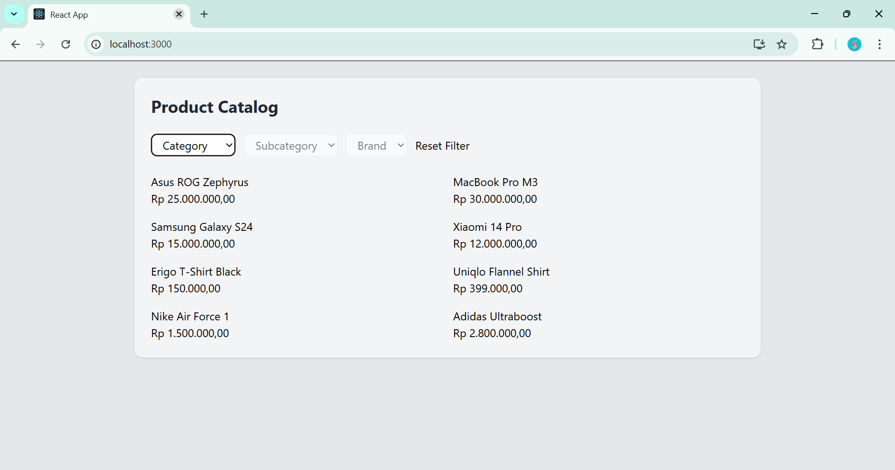
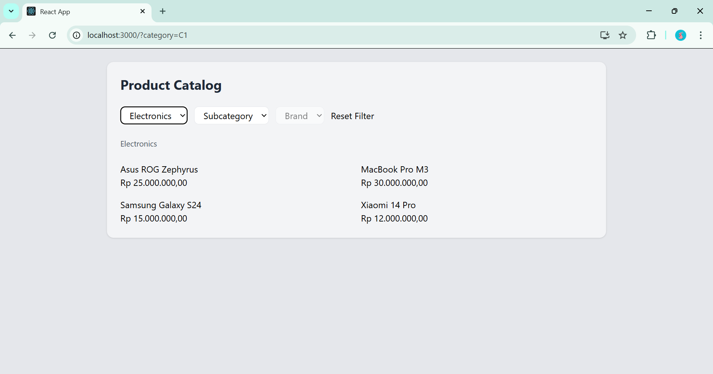
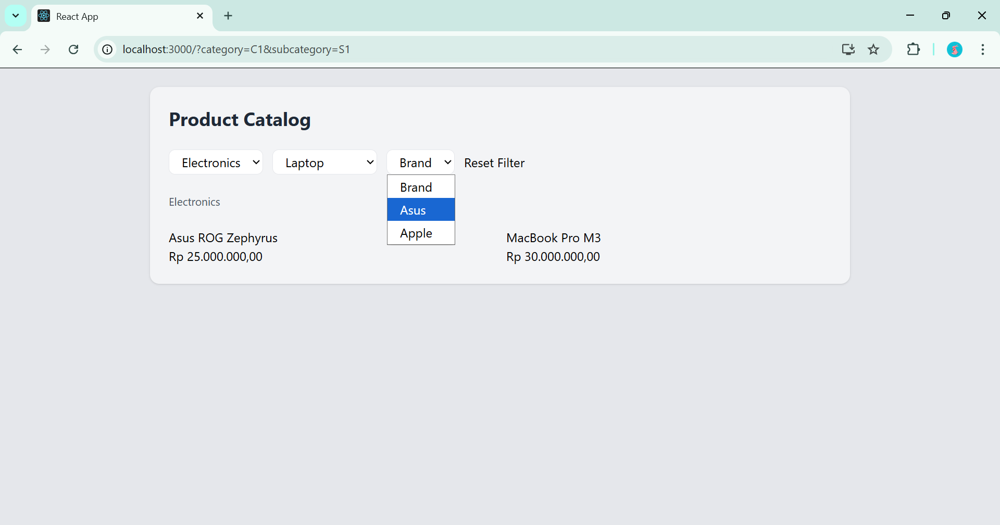
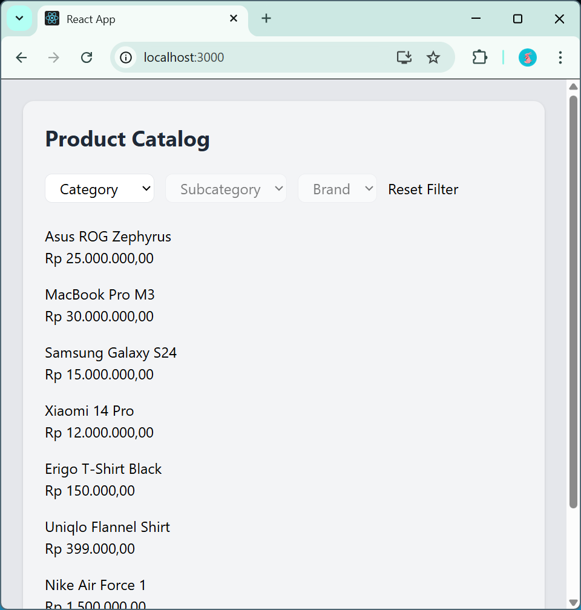

# 🛍️ Product Catalog with Cascading Filters

This project is a simple product catalog application built with React. It demonstrates dynamic filtering using cascading dropdowns (Category → Subcategory → Brand) with URL-based state management.

---

## 🚀 Features

* Dynamic product filtering
* Cascading dropdowns:

  * Category → Subcategory → Brand
* URL-based state (filters persist on refresh)
* Breadcrumb navigation
* Reset filters functionality
* Responsive UI with Tailwind CSS

---

## 🧠 Tech Stack

* React (Create React App)
* React Router DOM (Data API: loader, search params)
* Tailwind CSS

---

## ⚙️ Setup & Installation

1. Clone the repository:

```bash
git clone https://github.com/egaherawati10/dropdown-filters.git

2. Install dependencies:

```bash
npm install
```

3. Run the project:

```bash
npm start
```

The app will run on:

```
http://localhost:3000
```

---

## 🔍 How It Works

* Filters are stored in the URL using `searchParams`
* The `loader` reads query parameters and provides data to the page
* Filtering logic is applied based on:

  * category → subcategory → brand → products

---

## 🎯 Key Implementation Details

* No external state management (Redux/Zustand)
* URL is the single source of truth
* Uses React Router Data API (`loader`)
* Accessible breadcrumb with `aria-label="breadcrumb"`
* Semantic HTML (`<section>` for product list)

---

## 📸 Screenshot

Initial State (No Filters Applied)



Category Selected



Subcategory Selected and Brand Activated



Responsive View



---

## 📌 Notes

This project was built as part of a coding challenge focusing on frontend architecture, state management, and clean implementation.

---

## 👤 Author

Ega Herawati